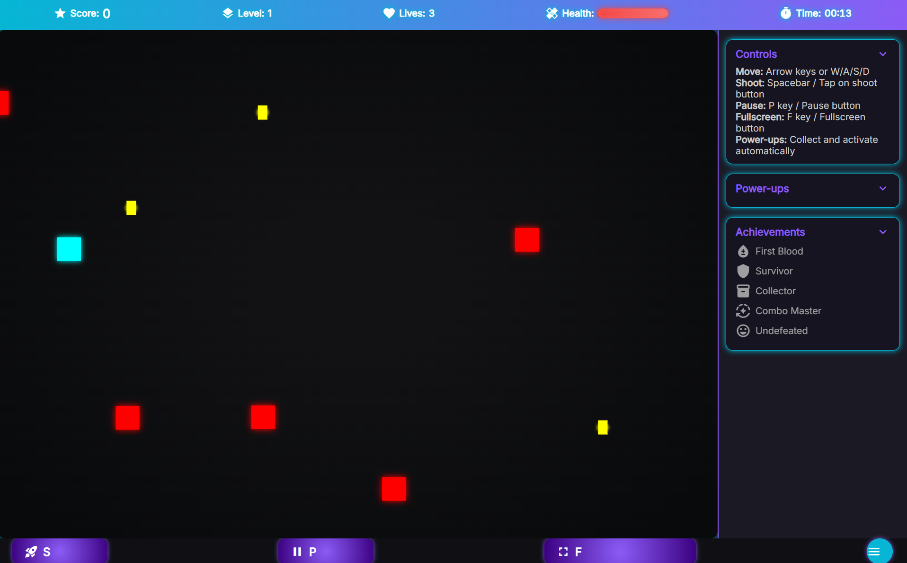

# NeonBlitz (BlackBoxAI)

"Neon Blitz" is a fast-paced, retro-futuristic arcade shooter built entirely with HTML5 Canvas, CSS, and vanilla JavaScript. This game combines vibrant neon aesthetics with smooth animations, particle effects, and responsive controls to deliver an engaging single-player experience right in the browser.

## Live Project :
https://aicomp-sketch.github.io/NeonBlitz/Source%20Code/
